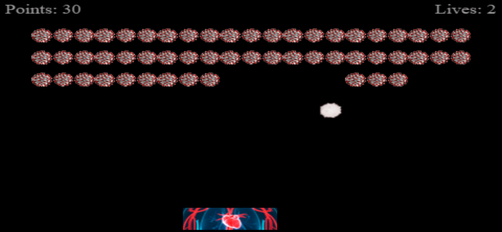
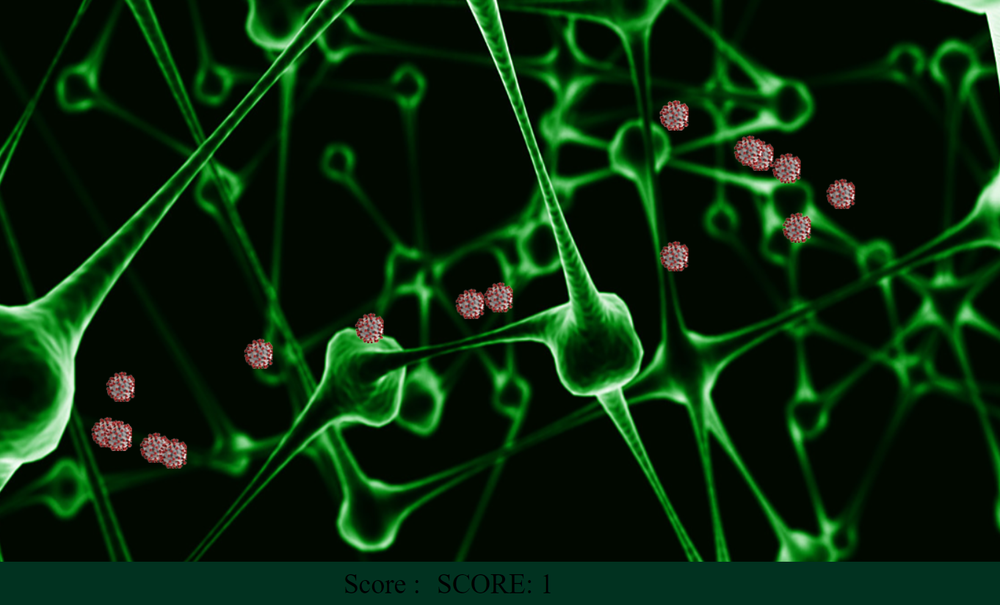

# JavaScript Games

## Simple implementations of basic 2D games

> ## Corona Breaker

A 2D breakout game made using phaser

 

> ## Corona Shooter

A duck shooter clone made using css animations

 

## In collaboration with:

- [Kavish Shah](https://github.com/KavishShah09)
- [Gaurav Raj](https://github.com/gauravraj0510)
- [Adarsh Tiwari](https://github.com/Adarsh1011)
- [Ishan Saksena](https://github.com/ishansaksena7)
- [Jash Makhija](https://github.com/jash6)
- [Aarya Devnani](https://github.com/AaryaDevnani)
- [Arjun Balamwar](https://github.com/ArjunBalamwar)
